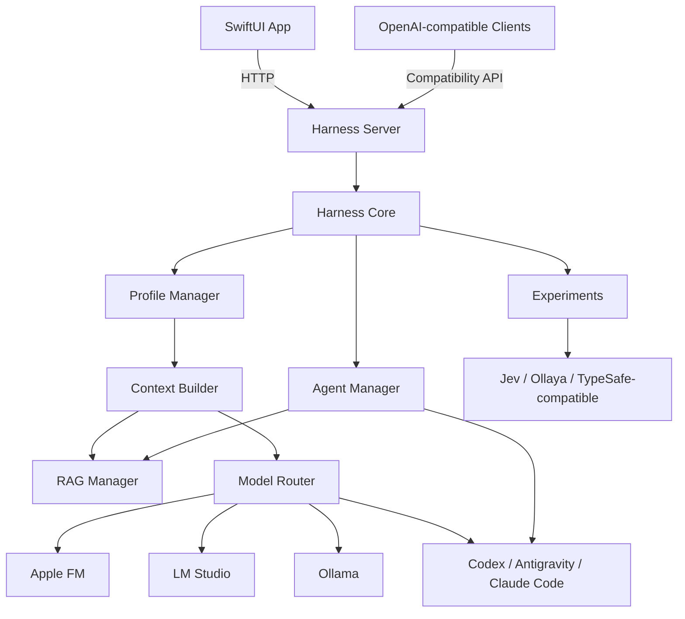

# Onigiri Harness 開発計画

更新日: 2026-10-05

## フェーズ表記

今後の開発計画、作業依頼、完了報告では、次の表記に統一します。

- **Parent Phase**: 製品としての大きな到達点
- **Sub-phase**: Parent Phaseを完成させる実装単位
- 表記例: `Parent Phase 1 / Sub-phase 1.3 — RAG Modes`
- `Phase`だけの表記は新しい計画では使用しない

これまで使用してきた0〜35の連番は、過去の実装履歴を識別する場合に限り`Legacy Phase`と表記します。Legacy Phase番号は、新しいParent Phase／Sub-phase番号の進捗を意味しません。

## 現在地

現在は、基盤、複数provider、Product Profiles、Chat Runtime、共通RAG、複数CLIのAIタスク／通常チャット連携、Decision Model Lab、OpenAI Compatibility API、セキュリティ、データ移行、最終手動受入まで実装済みです。次は配布用署名、公証、パッケージ作成へ進みます。

| Parent Phase | 状態 | 概要 |
| --- | --- | --- |
| Parent Phase 0 — Foundation & Runtime | 完了 | Skeleton、Chat、provider、Profiles、Context Builderを実装済み |
| Parent Phase 1 — Common RAG Platform | 完了 | Simple／Agentic RAG、評価、診断、カバレッジ管理を実装済み |
| Parent Phase 2 — AI Agent Integration | 完了 | Codex inbound／MCPと、Codex・Antigravity・Claude CodeのAIタスクを実装済み |
| Parent Phase 3 — Decision Models & Experiments | 完了 | Decision Model Lab、比較評価、confidence routingを実装済み |
| Parent Phase 4 — Local AI Gateway | 完了 | OpenAI Compatibility APIとCLI Chat Providersを実装済み |
| Parent Phase 5 — Productization | 進行中 | 5.1、5.1a、5.1bを完了。次は署名、公証、配布 |

次に着手するのは **Parent Phase 5 / Sub-phase 5.2 — Distribution & Release** です。

## Legacy Phaseとの対応

| 当初・過去の段階 | 新しい位置 | 状態 |
| --- | --- | --- |
| Legacy Phase 0 — Skeleton | Parent Phase 0 / Sub-phase 0.1 | 完了 |
| Legacy Phase 1 — Chat | Parent Phase 0 / Sub-phase 0.2、0.5 | 完了 |
| Legacy Phase 2 — Provider | Parent Phase 0 / Sub-phase 0.3 | 完了 |
| 旧計画のProfiles | Parent Phase 0 / Sub-phase 0.4 | 完了 |
| 旧計画のSimple RAG | Parent Phase 1 / Sub-phase 1.1、1.2 | 完了・拡張済み |
| Legacy Phase 11〜35 | 主にParent Phase 1 / Sub-phase 1.1、1.2 | 資料管理、検索、引用、評価として完了 |
| 旧計画のAgentic RAG | Parent Phase 1 / Sub-phase 1.4〜1.5 | 完了 |
| 旧計画のCodex outbound | Parent Phase 2 / Sub-phase 2.1 | 完了 |
| 旧計画のCodex inbound | Parent Phase 2 / Sub-phase 2.2 | 完了 |
| CodexタスクのAIタスク統合 | Parent Phase 2 / Sub-phase 2.3 | 完了 |
| 旧計画のJev Lab | Parent Phase 3 / Sub-phase 3.1 | 完了・Decision Model Labへ拡張 |
| 旧計画のCompatibility API | Parent Phase 4 / Sub-phase 4.1 | 完了 |
| CLIを通常チャットのモデルとして利用 | Parent Phase 4 / Sub-phase 4.2 | 完了 |

## 目標構成

RAG Managerは特定モデルに属さない共通資産とします。Apple FM、LM Studio、Ollama、Codex、Antigravity、Claude Codeが同じ検索・引用・評価基盤を利用できる構造を維持します。

## Parent Phase 0 — Foundation & Runtime

### Sub-phase 0.1 — Skeleton

状態: 完了

SwiftUI → HTTP → Harness Server → Harness Core → Apple FMという最小往復を確立しました。

### Sub-phase 0.2 — Chat Base

状態: 完了

メッセージモデル、複数ターン、Streaming、会話保存、エラー表示を実装しました。生成停止とキャンセル制御はSub-phase 0.5で完成しました。

### Sub-phase 0.3 — Model Providers

状態: 完了

`ModelProvider`を共通化し、Apple FM、LM Studio、Ollama、任意のOpenAI-compatibleローカルモデルを切り替えられるようにしました。

### Sub-phase 0.4 — Product Profiles

状態: 完了

モデル設定、Base URL、Model ID、システム指示、RAGモード、検索設定、コンテキスト上限を1つのProfileとして保存するようにしました。作成、複製、名称変更、削除、既定Profile指定、会話ごとのProfile選択をUIから行えます。現在の`@AppStorage`設定は初回Profileへ移行します。

完了条件:

- `general`、`apple-local`、任意のローカルモデルProfileを作成できる
- Profile切替でモデル、指示、RAG設定が一括で切り替わる
- 再起動後もProfileと会話への割り当てが復元される
- 既存設定からの移行で会話、資料、評価データが失われない

### Sub-phase 0.5 — Chat Runtime & Context Builder

状態: 完了

会話履歴、システム指示、資料、選択チャンク、言語・書き換え指示を組み立てるContext BuilderをCore内の独立要素にしました。生成停止、HTTP切断時のキャンセル、コンテキスト予算、履歴圧縮方針もここで統一しています。

完了条件:

- UIの停止ボタンでApple FMとローカルモデルの生成を中断できる
- 中断後に同じ会話で再送信できる
- Context Builderの入力と出力を単体テストできる
- モデル変更後も同じコンテキスト方針が適用される

## Parent Phase 1 — Common RAG Platform

### Sub-phase 1.1 — Simple RAG

状態: 完了

TXT、Markdown、PDF、フォルダ取込、チャンク分割、Keyword・日本語n-gram・Embedding検索、Top K、引用、永続化、資料プレビューを実装しました。

### Sub-phase 1.2 — RAG Operations & Evaluation

状態: 完了

Legacy Phase 21〜35で、チャンク管理、検索設定、手動選択、評価ケース、評価環境、回帰検出、自動評価、スイート、資料版、カバレッジ、候補生成を実装しました。

### Sub-phase 1.3 — RAG Modes & RAG Manager

状態: 完了

RAG処理を正式なRAG Managerへ分離し、Profileごとの`disabled`と`always`を共通の実行モードとして完成させました。会話と評価結果に使用モードを記録し、次の`agentic`モードが利用する`searchKnowledge`と`getKnowledgeChunk`のモデル非依存Tool契約とHTTP APIを定義しました。既存の`knowledge.json`と過去の評価データは引き続き読み込めます。

完了条件:

- `disabled`では資料がプロンプトへ入らない
- `always`では現在と同等以上の検索・引用が動く
- モード変更が会話と評価レポートへ記録される
- `searchKnowledge`と`getKnowledgeChunk`をモデル非依存のToolとして呼べる

### Sub-phase 1.4 — Agentic RAG

状態: 完了

AIが質問ごとに検索要否、検索語、再検索語をJSONで判断する実行ループを追加しました。検索は共通のRAG Managerを最大2回呼び出し、弱い結果だけを5秒以内で再検索します。取得数はProfileの上限に従います。構造化された判断を返せないモデルでは`always`へフォールバックします。判断理由、検索語、Tool回数、所要時間、取得チャンクを会話へ記録し、UIとMarkdownで確認できます。

完了条件:

- 資料不要の質問では検索を行わない
- 資料が必要な質問では検索語を生成して根拠付きで回答する
- 検索結果が弱い場合に上限内で再検索できる
- Tool判断、検索語、取得チャンク、引用を追跡できる
- Apple FM、LM Studio、Ollamaで同じRAGモード契約が動く

### Sub-phase 1.5 — Agentic Evaluation & RAG Diagnostics

状態: 完了

既存の評価基盤をAgentic RAGへ接続しました。ケースごとに検索要否を設定し、検索判断の適合率・再現率、誤検索、検索漏れ、再検索による回復を測定します。検索語不足、閾値、Keyword／Embedding配分、チャンク境界を原因候補として表示します。全資料の未評価チャンクからケース候補を一括生成でき、評価環境にはRAGモードも保存してProfile・モデル・モードを分けて比較できます。CLIでも`--rag-mode`を指定できます。

完了条件:

- 検索要否の適合率・再現率を測定できる
- 検索語不足、分割設定、閾値、Keyword／Embedding配分を原因候補として表示する
- カバレッジの弱い資料から評価ケースを一括生成できる
- Profile、RAGモード、モデル間の回帰を比較できる

## Parent Phase 2 — AI Agent Integration

### Sub-phase 2.1 — Codex Outbound

状態: 完了

Agent ManagerとCodex CLI Adapterを追加し、Harnessから明示的にCodexへ単発タスクを渡せるようにしました。タスク画面では作業フォルダ、任意のモデル、読み取り専用／作業フォルダ書き込み、タイムアウトを指定できます。JSONLイベントから進行状況と最終結果を取り込み、入力、結果、失敗、キャンセル、タイムアウトを会話とは別の実行記録として最大100件保存します。

完了条件:

- UIからCodexタスクを開始できる
- タスクの進行、完了、失敗を表示できる
- 会話本文とCodex実行履歴を分けて保存できる
- キャンセルとタイムアウトが機能する

### Sub-phase 2.2 — Codex Inbound / MCP

状態: 完了

OnigiriのRAGをCodexから利用できるstdio MCP Server `onigiri-mcp`として公開しました。`searchKnowledge`と`getKnowledgeChunk`には入力スキーマと読み取り専用注釈を付け、資料追加・削除などの変更操作は公開していません。Tool呼び出しは入力概要、成否、所要時間、結果数とともに最大500件保存し、アプリのMCP画面から確認・クリアできます。

完了条件:

- Codexから資料検索とチャンク取得ができる
- 引用可能な資料ID、チャンクID、タイトルが返る
- 読み取り操作と変更操作の権限が分離される
- Tool呼び出しを監査ログで確認できる

### Sub-phase 2.3 — Multi-CLI Agent Adapters

状態: 完了

従来の「Codexタスク」を「AIタスク」へ統合し、Codex、Google Antigravity、Claude Codeを同じ画面とAPIから選択できるようにしました。各CLIは専用AdapterでコマンドとStreaming JSONを変換し、共通Managerが進行、結果、失敗、キャンセル、タイムアウト、履歴を管理します。タスクごとに独立したプロセスを起動するため、複数providerを同時実行できます。旧APIとproviderのない旧履歴はCodexとして引き続き読み込めます。

完了条件:

- AIタスク画面でCodex、Antigravity、Claude Codeを選択できる
- 利用可能性、実行AI、モデル、アクセス設定を確認できる
- 異なるCLIを含む複数タスクを同時実行できる
- providerのない旧Codex履歴をCodexとして自動移行できる
- 利用できないCLIは他のCLIの実行を妨げず、画面に状態を表示する

## Parent Phase 3 — Decision Models & Experiments

### Sub-phase 3.1 — Decision Model Lab

状態: 完了

Jev専用ではなく、複数のJevライクな意思決定モデルを差し替えられるDecision Model Labを追加しました。OllayaローカルAPIとTypeSafe互換APIをProviderとして分離し、モデル一覧を動的に取得します。状態はテキストまたはJSON、質問は`choice`、`score`、`noul`へ正規化します。確率、confidence、routing、処理時間を含む生レスポンスと失敗を通常Profile・会話・RAGから独立して最大200件保存します。APIキーは履歴へ保存しません。

完了条件:

- Jev、Ollaya、TypeSafe互換Providerを同じ実験形式で扱える
- Ollaya内のモデルファミリーをコード変更なしで列挙・選択できる
- 実験ごとに状態、質問、Provider、モデル、結果、失敗を保存・比較できる
- APIキーを履歴へ保存せず、実験APIの失敗を通常処理から隔離できる
- 意思決定結果から外部操作を自動実行しない

### Sub-phase 3.2 — Decision Evaluation & Routing Policies

状態: 完了

ラベル付き評価ケースを作成し、同じケースを複数モデルで実行して正解率、calibration error、遅延、完了数、fallback率を比較できるようにしました。既定およびモデル別・質問別のconfidence閾値とfallback先を設定できます。低confidence時のLLM／人へのfallbackはレポートへ記録するシミュレーションで、外部操作は行いません。評価レポートは通常の実験履歴から分離して最大100件保存し、ProviderのAPIキーは保存しません。

完了条件:

- 同じ評価セットを複数の意思決定モデルで実行できる
- accuracy、calibration error、遅延を比較できる
- モデル別・質問別のconfidence閾値を保存できる
- local decision → LLM／人のfallbackをシミュレーションできる
- 自動実行前に判断根拠と適用policyを監査できる

## Parent Phase 4 — Local AI Gateway

### Sub-phase 4.1 — Compatibility API

状態: 完了

Harness ServerにOpenAI-compatibleな`/v1/models`と`/v1/chat/completions`を公開しました。非StreamingとSSE Streamingに対応し、`model`から現在モデル、ロード済みモデル、`profile/<UUID>`を選択できます。標準レスポンスへ影響しない`onigiri`拡張にRAGモード、引用、Agentic RAG traceを格納します。リクエスト単位のProfile／モデル選択はアプリの現在Providerや会話セッションを変更しません。`/v1/embeddings`は、共通APIとして公開する認証・上限・用途が未確定のため、このSub-phaseでは追加していません。

完了条件:

- 非StreamingとStreamingのChat Completionsが動く
- ProfileまたはモデルをAPIから選択できる
- RAGモードと引用情報を互換性を壊さず扱える
- 既存のOnigiri独自APIが引き続き動く

### Sub-phase 4.2 — AI CLI Chat Providers

状態: 完了

Codex、Google Antigravity、Claude CodeのCLI Adapterを`ModelProvider`としても利用できるようにしました。アプリ上部のモデル選択から通常チャットへ切り替えられ、Product Profile、会話文脈、RAG、Compatibility APIの共通経路を使います。CLI Chatは専用の空作業フォルダと読み取り専用モードで実行し、モデルIDが空欄なら各CLIのアカウント既定値を使用します。CLIごとのモデルカタログはログイン状態とバージョンで変わるため、モデルIDは自由入力です。

完了条件:

- モデル選択にCodex、Antigravity、Claude Codeを表示できる
- 導入・ログイン済みCLIは通常チャットの回答を返せる
- 未導入CLIは他Providerを妨げず、利用不可理由を表示できる
- CLI Chatが読み取り専用の専用作業フォルダで動作する
- Profile、会話文脈、RAG、停止処理を既存Chat Runtimeと共有できる

## Parent Phase 5 — Productization

### Sub-phase 5.1 — Security, Reliability & Migration

状態: 完了

ローカルGateway、MCP、AIタスク連携の境界を固めました。Serverは既定でloopbackだけをlistenし、外部待受は環境変数による明示許可とBearer tokenの両方がなければ起動しません。Decision LabのAPI keyはmacOS Keychainへ保存できます。保存領域にはversion metadataを追加し、初回移行前の安全コピー、チェックサム付き一括バックアップ、復元前のロールバックコピー、JSON破損診断と破損ファイル保全を実装しました。AIタスクの書き込みモードはsymlink解決後の実在・書き込み権限を検査し、ルートフォルダを拒否します。

完了条件:

- 外部公開を明示的に有効化しない限りloopback限定になる
- APIキーなどを平文ファイルへ保存しない
- 会話、Profile、資料、評価データをバックアップ・復元できる
- 旧データを自動移行し、失敗時に元へ戻せる

### Sub-phase 5.1a — Release-blocking Fixes

状態: 完了

受入試験で検出したApple Foundation Modelsの生成失敗、Agentic RAG再検索によるprimary一致の脱落、本文とmetadataの引用番号不一致、追従変換への不要な引用引き継ぎ、Antigravity headless実行の汎用結果を修正しました。自動テスト82件、アプリビルド、署名検証、Apple Foundation ModelsとAntigravityの隔離実動作確認に合格しています。

完了条件:

- Apple Foundation Modelsで生成でき、生のSensitiveContentAnalysisMLエラーを利用者へ露出しない
- Agentic RAGのretry後もprimary最上位一致を保持する
- 回答本文の引用番号とmetadataを一致させ、追従変換へ無関係な引用を付けない
- Antigravityの読み取り専用headlessタスクが具体的な結果を返す

### Sub-phase 5.1b — Final Manual Acceptance

状態: 計画済み

Release blocker解消後の最終受入です。Profileの保存と再起動復元、停止・Markdown書出し・削除、指定ウインドウサイズとライト外観、キーボード操作、横スクロール表示、規定回数の再起動を実UIで確認します。削除操作は対象を明示して実行直前に確認します。

完了条件:

- 残るP0／P1受入項目がすべてPASSまたは環境理由を記録したSKIPPEDになる
- 標準サイズ、指定サイズ、ライト／ダークで操作不能なUI崩れがない
- 会話の停止、書出し、履歴復元を実UIで確認する
- 配布判定に残る既知問題と制約を確定する

### Sub-phase 5.2 — Distribution & Release

状態: 計画済み

配布用署名、公証、初回起動案内、診断書き出し、更新方針を整えます。同時にGitHubでのソース公開とGitHub Releasesでのバイナリ配布を可能にします。公開リポジトリ向けにライセンス、貢献手順、セキュリティ報告窓口、Issue／Pull Requestテンプレート、CIを整備し、履歴を含む秘密情報検査を通します。対応macOSとApple Intelligence要件を明示し、Apple FM、LM Studio、Ollama、利用可能なCLI providerの基本シナリオをリリース前に実機確認します。

作業区分:

- Sub-phase 5.2a — Repository Readiness（完了）: `StayHomeLabNet/onigiri-harness`をPrivateで作成し、`main`へ初回commitをpush。Apache-2.0、除外規則、秘密情報検査、README、貢献／セキュリティ文書、Issue／Pull Requestテンプレートを整備済み
- Sub-phase 5.2b — Reproducible Build & CI（完了）: `VERSION`を単一のversion源とし、クリーンbuild directoryでのReleaseビルド、標準化したZIP名、SHA-256、公開前検査を実装。GitHub ActionsはmacOS 26 ARM64／Xcode 26.6でテスト・ビルド・成果物検証を行い、Git履歴を含む秘密情報検査を行う
- Sub-phase 5.2c — Signed macOS Distribution: Developer ID署名、Hardened Runtime、公証、staple、DMGまたはZIP作成、別MacでのGatekeeper確認
- Sub-phase 5.2d — GitHub Release: tag、変更履歴、署名・公証済み成果物、checksum、既知の制約をGitHub Releasesへ掲載
- Sub-phase 5.2e — Public Launch Verification: 公開リポジトリからのclone、ビルド、インストール、初回会話、RAG、更新・ロールバック手順を第三者視点で確認

完了条件:

- 署名・公証済みアプリを別Macで起動できる
- 初回設定から最初の会話・資料検索まで案内される
- 主要providerのスモークテストが成功する
- 診断情報から秘密情報を除外して書き出せる
- 公開GitHubリポジトリをクリーンcloneしてテストとアプリビルドを再現できる
- ライセンス、CONTRIBUTING、SECURITY、Issue／Pull Requestテンプレートが公開される
- CIがテスト、ビルド、秘密情報・不要ファイル検査に合格する
- GitHub Releaseから署名・公証済み成果物とchecksumを取得できる
- 公開履歴にAPIキー、個人資料、会話、ローカルパス、バックアップが含まれない

## 実装順序と依存関係

```mermaid
flowchart LR
    P04[Sub-phase 0.4 Profiles]
    P05[Sub-phase 0.5 Context Builder]
    P13[Sub-phase 1.3 RAG Modes]
    P14[Sub-phase 1.4 Agentic RAG]
    P15[Sub-phase 1.5 Agentic Evaluation]
    P21[Sub-phase 2.1 Codex Outbound]
    P22[Sub-phase 2.2 Codex Inbound]
    P23[Sub-phase 2.3 Multi-CLI Agents]
    P31[Sub-phase 3.1 Decision Model Lab]
    P32[Sub-phase 3.2 Decision Evaluation]
    P41[Sub-phase 4.1 Compatibility API]
    P42[Sub-phase 4.2 CLI Chat Providers]
    P51[Sub-phase 5.1 Hardening]
    P52[Sub-phase 5.2 Release]

    P04 --> P05 --> P13 --> P14 --> P15 --> P21 --> P22 --> P23 --> P31 --> P32 --> P41 --> P42 --> P51 --> P52
```

Parent Phase 0と1でCoreの責務を固めてから外部連携へ進みます。AIタスク、意思決定モデル、Compatibility APIは個別のRAG実装を持たず、同じProfile、Context Builder、RAG Manager、評価基盤を共有します。

## 実装原則

- 開発計画と進捗報告ではParent Phase／Sub-phaseを必ず併記する
- UI、HTTP、Core、providerの依存方向を維持する
- モデル固有処理をRAG ManagerやProfile Managerへ混ぜない
- 新しい保存形式にはバージョンと移行処理を用意する
- 自動判断には上限、キャンセル、監査可能な記録を付ける
- 各Sub-phaseは完了条件をテストしてから次へ進む
- 既存の会話、資料、評価データとの後方互換性を維持する
